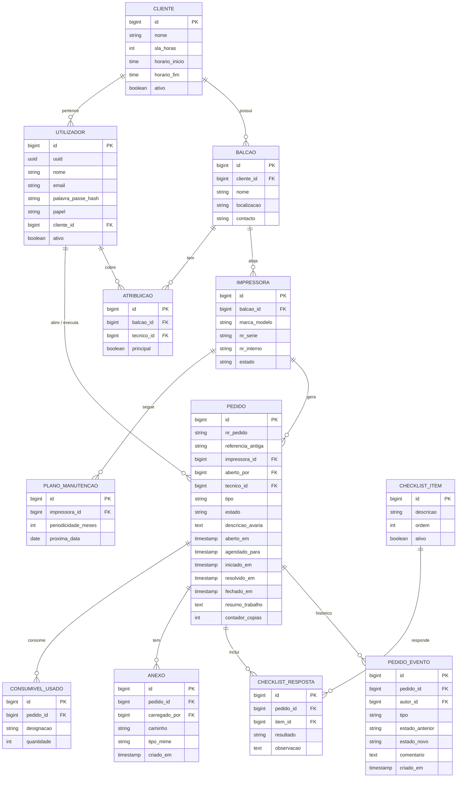

# Modelo de dados

Transcrição do [DER actual](DER_Portal_Pedidos_Intervencao.svg) ([PNG](DER_Portal_Pedidos_Intervencao.png)). O racional de cada entidade está na §9 dos [Requisitos v2.5](../01-requisitos/Requisitos_v2.5.md) e as notas de mapeamento JPA estão na §13.4.

> Os tipos (`bigint`, `time`, etc.) seguem a §13.4 da v2.5. O DER original só indica nomes, PK e FK. Na imagem, só o `utilizador` mostra a coluna `uuid`, mas a v2.5 diz que todas as entidades expostas na API a devem ter.

## Lacunas conhecidas

Inconsistências entre o DER e os requisitos. Convém resolvê-las antes da primeira migração Flyway:

| # | Lacuna | Requisito afectado |
|---|---|---|
| L1 | Não existe uma tabela `utilizador_balcao`. O Utilizador Cliente está associado "a um ou mais balcões" e o RN02 limita a visibilidade por balcão, mas o DER só tem `cliente_id`. | Glossário, RN02, `GET /me` |
| L2 | `pedido.resolvido_em` existe, mas a máquina de estados não tem o estado "resolvido": o fecho é feito num só passo. Ou se remove a coluna, ou se define quando é preenchida. | §6 |
| L3 | A v2.5 diz que os anexos podem estar "associados a pedido ou evento", mas `anexo` só tem `pedido_id`. | §9, RF12 |
| L4 | O `uuid` público só aparece no `utilizador`. | §13.4 |
| L5 | Falta a tabela de outbox das notificações, que a §13.2 exige. | RF27–RF30 |
| L6 | Falta guardar o canal de notificação preferido de cada utilizador (email ou SMS) e o seu telefone. | RF30 |
