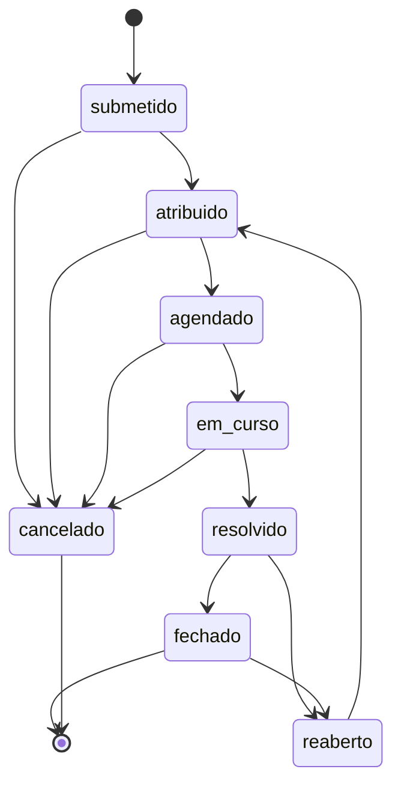

# Modelo de dados e estados

Base proposta depois das correcções conceptuais. O diagrama completo de entidades não veio no texto de origem; ficam aqui as peças que o texto fixa e a forma como se relacionam.

## Peças do modelo

| Peça | Papel |
| --- | --- |
| `Utilizador` | Pessoa no sistema. Os papéis (administrador, cliente, técnico de impressora, técnico de HelpDesk) são atributos deste utilizador, não tabelas separadas. |
| `Balcão` / `Agência` | Onde a impressora está. É a unidade a que se atribui responsabilidade. |
| `Impressora` | Máquina associada a um balcão, não apenas a um `IDCliente`. |
| `Atribuicao` | Técnico principal de um balcão, com espaço para substituições. |
| `Pedido` | Pedido de avaria. O campo `estado` é uma projecção, não a fonte de verdade. |
| `PedidoEvento` | Histórico append-only. Fonte de verdade do que aconteceu ao pedido. |

## Atribuição

`Atribuicao` resolve o caso em que vários técnicos intervêm na mesma máquina. Fixa o técnico principal por balcão sem impedir substituições.

## Histórico

`PedidoEvento` é a fonte de verdade do histórico. O campo `estado` do pedido é apenas a projecção do último evento. Actualizar um pedido acrescenta um evento; não reescreve os anteriores.

Isto torna possíveis o histórico por ID de máquina (RNF02) e o alerta de reincidência em 15 dias (RNF05).

## Máquina de estados

O RNF03 propõe só «Actualizado ou Pendente». Com dois estados não se mede nada. O mínimo viável:

`submetido → atribuído → agendado → em curso → resolvido → fechado`

Ramos laterais: `cancelado` e `reaberto`.

## O que cada intervalo mede

| Intervalo | Mede |
| --- | --- |
| `submetido` → `em curso` | SLA de 2 horas |
| `em curso` → `resolvido` | Tempo de reparação |
